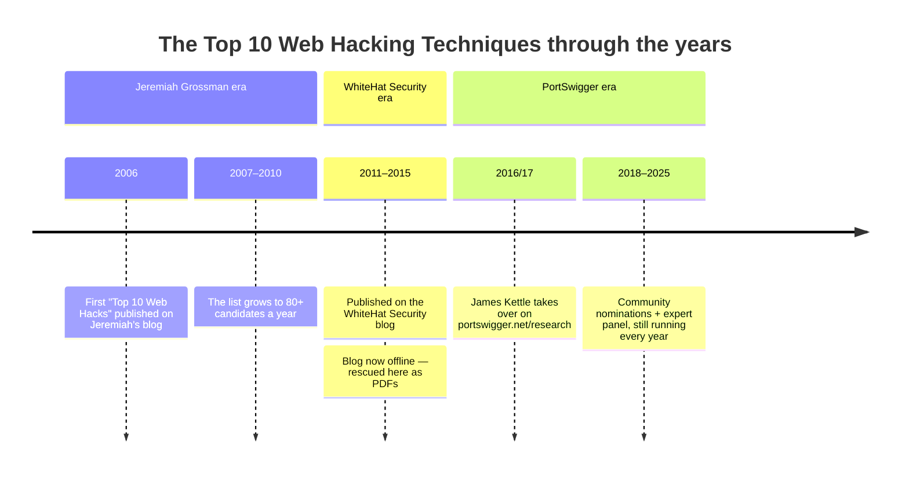

<div align="center">


<br><br>

[](https://webhacklist.com)
[](https://github.com/irsdl/webhacklist/stargazers)
[](https://github.com/irsdl/webhacklist/fork)
[](https://github.com/irsdl/webhacklist/commits)
[](#contributing)
[](https://github.com/sponsors/irsdl)

**The complete archive of the _Top 10 Web Hacking Techniques_ — every nominated technique
(not just the winners) for every year since 2006, plus PDF snapshots of the original
announcement posts so the record survives its hosts.**

### 🌐 Read it online at **[webhacklist.com](https://webhacklist.com)**

Search every technique, filter by year, and open any preserved document without leaving the browser.

[Browse by year](#-browse-by-year) ·
[Where things are](#-where-things-are) ·
[File layout](#-how-each-year-file-is-laid-out) ·
[The three eras](#-two-decades-three-homes) ·
[The PDF archive](#-preserving-the-record) ·
[Face the Judge](#-face-the-judge) ·
[Support](#-support-this-archive) ·
[Contributing](#contributing)

</div>

---

## 🔎 What is this?

Every year since 2006, the web security community has nominated the most innovative
web hacking research, voted, and crowned a **Top 10**. The list was started by
[Jeremiah Grossman](https://twitter.com/jeremiahg) and is continued today by
[James Kettle](https://twitter.com/albinowax) at PortSwigger.

The annual announcement posts, however, have a habit of disappearing — WhiteHat
Security's blog (home of the 2011–2015 lists) is already gone. This repository keeps
the whole thing in one durable, greppable place:

- **One Markdown file per year** with *every* nominated technique — all **1,136**
  of them, plus **351** later audit finds the nomination rounds missed, for
  **1,487 techniques** spanning two decades of web security research.
- **PDF snapshots** of the original nominee and winner announcement pages, captured with
  reproducible tooling and recorded provenance.

> [!IMPORTANT]
> The year lists are **complete**: everything that was officially nominated is in.
> That said, the nomination rounds occasionally missed notable research. If you know
> of work that should have been on a year's list, open an issue or PR — anything that
> qualifies as a web hacking technique nominee for that year will be reviewed and,
> if it fits, added to its relevant year. Later audit additions are visibly separated
> from the original nominations, require a score of **60 or above** plus a verified
> non-duplicate verdict, and retain both accepted and rejected evidence under
> [`ai-evaluation/`](ai-evaluation/).

> [!TIP]
> Many of the older links have died. Paste any dead URL into the
> [Wayback Machine](https://web.archive.org/) — most are preserved there, and the
> [PDF archive](original-listings/) preserves the announcement pages themselves.

## 🗺️ Where things are

```text
webhacklist/
├── 2006.md … 2025.md         ← the lists — every nominated technique, one file per year
├── <year>-ai.md              ← AI-collected candidates for a year with no vote yet — machine-assembled, unreviewed, kept deliberately separate from the curated lists above
├── ai-evaluation/<year>/     ← all AI-reviewed leads, readable scorecards, and append-only judgement history
├── original-listings/        ← PDF snapshots of the original announcement posts
│   ├── <year>-nominees.pdf   ←   the full nominee list for that year
│   ├── <year>-top10.pdf      ←   the post naming the winning ten
│   └── README.md             ←   per-year index, notes, and archive rationale
├── website/                   ← production progressive archive website
│   ├── archive-years.json     ←   publishing registry
│   └── data/                  ←   generated small catalogue + one JSON shard per collection
├── tools/                    ← the capture pipeline that builds the PDF archive
│   ├── capture_pdf.py        ←   headless-Chrome capture driver + verifier
│   ├── sources.json          ←   manifest: what to capture, from where, with assertions
│   └── capture-report.json   ←   provenance log of the last run
└── assets/                   ← logo and artwork
```

## 📖 How each year file is laid out

Every `<year>.md` opens with a **`## Top 10`** section holding the ten techniques that
actually won that year's vote, in finishing order, each tagged with its rank:

```markdown
## Top 10

-   [Blind SSTI](https://github.com/vladko312/Research_Successful_Errors) **#1**
-   [ORM Leaking More Than You Joined For](https://www.elttam.com/blog/leaking-more-than-you-joined-for/) **#2**
```

Every year file uses that one layout: one `-` bullet per technique, no trailing
backslashes and no blank lines inside the lists.

Everything else nominated that year follows under **`## Other nominations`**, unranked
and in its original order. So you can read the ten that stood out without losing the
long tail — which is often where the genuinely novel work hides.

> [!NOTE]
> Ranks come from the announcement posts, but the entry text stays as the nominee list
> had it. A winner's title in the results post is sometimes shorter or worded
> differently from its nomination, so the two don't always read identically.

### Research that was held out of the vote

In four years the organisers kept some research out of the competition to avoid a
conflict of interest. Rather than let it vanish, those entries sit at the top of
`## Other nominations`, each tagged with the stage it was held out of — the stages
differed, so the wording does too — under a note explaining what happened:

| Year | Held out | Why |
|---|---|---|
| [2016/17](2016-17.md) | Cracking the Lens; XSS without HTML | PortSwigger research was excluded up front; by the time a recusal system replaced that rule it was too late to reintroduce it, so it never even reached the nominee list |
| [2019](2019.md) | HTTP Desync Attacks | Won the community vote outright, but James Kettle declined to rank his own research first |
| [2024](2024.md) | Gotta cache 'em all; Splitting the email atom; Listen to the whispers | All three reached the final fifteen and were then held out of the panel vote |
| [2025](2025.md) | HTTP/1.1 must die | Reached the final fifteen, held out of the panel's top ten |

Every other year the organisers state that their own research competed normally — in
2020 PortSwigger's *Portable Data exFiltration* placed 2nd, and in 2021 *HTTP/2: The
Sequel is Always Worse* placed 2nd — so nothing is missing from those.

## 📅 Browse by year

Each year links to its curated list. **Nominated** counts the techniques that went into
that year's official round — the community nominated far more than ten per year.
**Audit** counts the research that round missed, recovered later and kept visibly
separate under `## Missed from the original list`.

| Year | Nominated | Audit | Total | 🏆 #1 technique | Archived PDFs | Original post |
|---|---:|---:|---:|---|---|---|
| [2025](2025.md) | 67 | 13 | 80 | Successful Errors | [nominees](original-listings/2025-nominees.pdf) · [top 10](original-listings/2025-top10.pdf) | [PortSwigger](https://portswigger.net/research/top-10-web-hacking-techniques-of-2025) |
| [2024](2024.md) | 119 | 21 | 140 | Confusion Attacks | [nominees](original-listings/2024-nominees.pdf) · [top 10](original-listings/2024-top10.pdf) | [PortSwigger](https://portswigger.net/research/top-10-web-hacking-techniques-of-2024) |
| [2023](2023.md) | 68 | 16 | 84 | Smashing the State Machine | [nominees](original-listings/2023-nominees.pdf) · [top 10](original-listings/2023-top10.pdf) | [PortSwigger](https://portswigger.net/research/top-10-web-hacking-techniques-of-2023) |
| [2022](2022.md) | 46 | 23 | 69 | Dirty Dancing in Sign-in OAuth Flows | [nominees](original-listings/2022-nominees.pdf) · [top 10](original-listings/2022-top10.pdf) | [PortSwigger](https://portswigger.net/research/top-10-web-hacking-techniques-of-2022) |
| [2021](2021.md) | 40 | 13 | 53 | Dependency Confusion | [nominees](original-listings/2021-nominees.pdf) · [top 10](original-listings/2021-top10.pdf) | [PortSwigger](https://portswigger.net/research/top-10-web-hacking-techniques-of-2021) |
| [2020](2020.md) | 54 | 12 | 66 | H2C Smuggling | [nominees](original-listings/2020-nominees.pdf) · [top 10](original-listings/2020-top10.pdf) | [PortSwigger](https://portswigger.net/research/top-10-web-hacking-techniques-of-2020) |
| [2019](2019.md) | 50 | 16 | 66 | Cached and Confused | [nominees](original-listings/2019-nominees.pdf) · [top 10](original-listings/2019-top10.pdf) | [PortSwigger](https://portswigger.net/research/top-10-web-hacking-techniques-of-2019) |
| [2018](2018.md) | 54 | 22 | 76 | Breaking Parser Logic | [nominees](original-listings/2018-nominees.pdf) · [top 10](original-listings/2018-top10.pdf) | [PortSwigger](https://portswigger.net/research/top-10-web-hacking-techniques-of-2018) |
| [2016/17](2016-17.md) | 39 | 56 | 95 | A New Era of SSRF | [nominees](original-listings/2016-17-nominees.pdf) · [top 10](original-listings/2016-17-top10.pdf) | [PortSwigger](https://portswigger.net/research/top-10-web-hacking-techniques-of-2017) |
| [2015](2015.md) | 39 | 29 | 68 | FREAK | [combined](original-listings/2015-nominees-and-top10.pdf) | [Wayback](https://web.archive.org/web/20171225140648/https://www.whitehatsec.com/blog/top-10-web-hacking-techniques-of-2015/) † |
| [2014](2014.md) | 46 | 20 | 66 | Heartbleed | [combined](original-listings/2014-nominees-and-top10.pdf) | [Wayback](https://web.archive.org/web/20160319055228/https://www.whitehatsec.com/blog/top-10-web-hacking-techniques-of-2014/) † |
| [2013](2013.md) | 32 | 19 | 51 | Mutation XSS | [combined](original-listings/2013-nominees-and-top10.pdf) | [Wayback](https://web.archive.org/web/20160312115418/https://www.whitehatsec.com/blog/top-10-web-hacking-techniques-2013/) † |
| [2012](2012.md) | 56 | 20 | 76 | CRIME | [combined](original-listings/2012-nominees-and-top10.pdf) | [Wayback](https://web.archive.org/web/20170903113359/https://www.whitehatsec.com/blog/top-ten-web-hacking-techniques-of-2012/) † |
| [2011](2011.md) | 51 | 16 | 67 | BEAST | [nominees](original-listings/2011-nominees.pdf) · [top 10](original-listings/2011-top10.pdf) | [Wayback](https://web.archive.org/web/20150109120123/https://www.whitehatsec.com/resource/grossmanarchives/12grossmanarchives/022112topten2011.html) † |
| [2010](2010.md) | 69 | 19 | 88 | 'Padding Oracle' Crypto Attack | [nominees](original-listings/2010-nominees.pdf) · [top 10](original-listings/2010-top10.pdf) | [Jeremiah's blog](https://blog.jeremiahgrossman.com/2011/01/top-ten-web-hacking-techniques-of-2010.html) |
| [2009](2009.md) | 83 | 11 | 94 | Creating a Rogue CA Certificate | [nominees](original-listings/2009-nominees.pdf) · [top 10](original-listings/2009-top10.pdf) | [Jeremiah's blog](https://blog.jeremiahgrossman.com/2010/01/top-ten-web-hacking-techniques-of-2009.html) |
| [2008](2008.md) | 70 | 10 | 80 | GIFAR | [nominees](original-listings/2008-nominees.pdf) · [top 10](original-listings/2008-top10.pdf) | [Jeremiah's blog](https://blog.jeremiahgrossman.com/2009/02/top-ten-web-hacking-techniques-of-2008.html) |
| [2007](2007.md) | 83 | 9 | 92 | XSS in Common Shockwave Flash Files | [nominees](original-listings/2007-nominees.pdf) · [top 10](original-listings/2007-top10.pdf) | [Jeremiah's blog](https://blog.jeremiahgrossman.com/2008/01/top-ten-web-hacks-of-2007-official.html) |
| [2006](2006.md) | 70 | 6 | 76 | Web Browser Intranet Hacking / Port Scanning | [combined](original-listings/2006-nominees-and-top10.pdf) | [Jeremiah's blog](https://blog.jeremiahgrossman.com/2006/12/top-10-web-hacks-of-2006.html) |
| **Total** | **1,136** | **351** | **1,487** | | | |

A further **47** AI-collected leads for 2026 sit in [`2026-ai.md`](2026-ai.md), unranked,
incomplete and not community-vetted, deliberately kept apart from the curated lists above.

† The WhiteHat Security blog is offline; these links go to the Wayback Machine —
which is exactly why the [PDF archive](original-listings/) exists.

## 🏛️ Two decades, three homes



| Years | Curator | Original host | Status |
|---|---|---|---|
| 2006–2010 | Jeremiah Grossman | `jeremiahgrossman.blogspot.com` | ✅ Live, now at `blog.jeremiahgrossman.com` |
| 2011–2015 | Jeremiah Grossman / Johnathan Kuskos | `whitehatsec.com/blog` | ☠️ Dead — captured from the Wayback Machine |
| 2016/17–2025 | James Kettle | `portswigger.net/research` | ✅ Live |

## 🗄️ Preserving the record

[original-listings/](original-listings/) holds PDF snapshots of every original
announcement page — for each year, both the **full nominee list** and the post naming
the **selected top ten**. They are generated by [tools/capture_pdf.py](tools/capture_pdf.py)
(headless Chrome over CDP, stdlib-only), driven by a manifest with content assertions,
and every file's provenance — source URL, HTTP status, page count — is logged in
[tools/capture-report.json](tools/capture-report.json).

```bash
python tools/capture_pdf.py list      # show the manifest
python tools/capture_pdf.py run       # capture anything not already present
python tools/capture_pdf.py verify    # re-check every PDF against its assertions
```

See [tools/README.md](tools/README.md) for the full usage and design notes, and
[original-listings/README.md](original-listings/README.md) for the per-year index.

> [!NOTE]
> **The articles themselves are preserved too.** The announcement pages are only half the
> story, so each cited research article is kept as its own Markdown + PDF copy under
> [`archived-references/`](archived-references/) — **1,531 of the 1,534 cited sources**
> today. **419** of them had to be recovered from the Wayback Machine because the original
> page no longer answers, and **25** non-English sources are kept in the original with an
> English translation beside them.

### Keeping the web apps in sync

The year Markdown, archive manifest, and year registry remain the sources of truth; the
web-app JSON is derived and should never be edited by hand. After archive data changes,
run:

```bash
python .claude/skills/webseclist-refresh-web-apps/scripts/refresh_web_apps.py
```

This refreshes the production website and validates its totals. The app first downloads
a roughly 8 KB catalogue and the requested collection (currently no shard is over 200 KB
raw), then warms the remaining versioned collection shards during idle time. Save-Data
and 2G clients stay strictly on-demand. When deploying, publish the shards before the
catalogue and revalidate the catalogue frequently; versioned shard URLs can use a long
cache lifetime. `website/build-site.mjs` stages only the archive documents referenced by
those shards, so adding a year or preserved reference automatically grows the deployed
site without maintaining a second hand-written index.

[`webhacklist.com`](https://webhacklist.com) runs on Cloudflare Pages, built with
`node website/build-data.mjs && node website/build-site.mjs --target cloudflare` and
`dist` as the output directory. A push to `master` is the only deploy step. The GitHub
Pages workflow is *not* a second copy of the app: it is a small file origin publishing
only the preserved PDFs that exceed Cloudflare Pages' 25 MiB per-file asset limit —
two of them today. Their exact URLs are declared in `website/hosting.json`, and the app
falls back to them transparently when a document is too large to serve from the primary
host. See [website/README.md](website/README.md) for DNS, cache, full-screen and mobile
deployment details.

## ⚖️ Face the Judge

**So you think your research is Top 10 material? Prove it.**

Twenty years of this list have made one thing clear: the work that lasts is rarely the
work with the scariest headline. So this repo ships a **research evaluator** — a Claude
Code skill, [`webseclist-judge-reference`](.claude/skills/webseclist-judge-reference/SKILL.md),
that reads a writeup, hunts for prior art across **both** the 1,500+ references archived
here **and** the wider web, and hands down a verdict: *original technique*, *meaningful
extension*, *clever combination*, *nice case study* … or the dreaded **"already known."**

It is a fair judge, and a merciless one. It does **not** care about your CVE number, your
bounty, your severity rating, your employer, or your follower count — none of those
measure whether you actually taught the field something new. A find that hands you
domain-admin on a bank can score *low* if the trick is textbook; an obscure parser quirk
that births a whole new primitive can score *high*. **Impact ≠ novelty.** That's the
entire point.

Every candidate is scored 0–100 across six weighted axes:

| Axis | Weight | It's really asking… |
|---|---:|---|
| 🧠 Original contribution | 25% | Did this teach the field something genuinely new? |
| 🌍 Transferability | 20% | Does the idea travel beyond the one target you hit? |
| ⏳ Lasting value | 20% | Will people still build on this in a few years? |
| 🔬 Technical soundness | 15% | Does the evidence actually back the claims? |
| 🛠️ Practical usability | 10% | Can others pick it up and use it? |
| 📆 Clarity & reproducibility | 10% | Is there enough here to follow and verify? |

Bands run **0–19** barely-there · **20–39** limited · **40–59** moderate · **60–79**
strong · **80–100** exceptional — and **50 is an honest middle, not a fail**. The weighted
total then maps to a verdict: **≥ 70** with a novelty verdict is *core-technique* material,
**≥ 50** earns *keep it as a supporting reference*, and below that it's *already covered*.

> [!TIP]
> **Brave enough?** In Claude Code, point it at your latest post:
> ```text
> /webseclist-judge-reference https://your-blog.example/your-shiny-new-technique
> ```
> No Claude Code? The rubric stands on its own — grade yourself by hand against
> [the scoring anchors and worked examples](.claude/skills/webseclist-judge-reference/references/scoring-rubric.md)
> before you hit publish. Best case, you find out you're sitting on something special.
> Worst case, you find the prior art before a reviewer does.

## 💛 Support this archive

Everything here is free and always will be. Two things keep it going:

- **⭐ [Star the repository](https://github.com/irsdl/webhacklist)** — the free one,
  and the one that actually helps. Stars are how researchers find this archive, and every
  one of them puts two decades of preserved research in front of someone who did not know
  it survived.
- **💛 [Sponsor on GitHub](https://github.com/sponsors/irsdl)** — preservation is the
  expensive part: hosting `webhacklist.com` and a growing pile of PDFs, chasing dead
  domains through the Wayback Machine, recapturing broken snapshots, and curating each
  year by hand. One-off or recurring, any amount is genuinely useful.

Sponsorship buys no influence over the lists — entries are added on the evidence, never
on who paid. Prefer to give time instead? [Contributing](#contributing) is worth as much.
Full details in **[SUPPORT.md](SUPPORT.md)**.

## Contributing

The quickest route is the **Submit research** button on
[webhacklist.com](https://webhacklist.com/#submit) — it searches the archive as you type,
tells you straight away whether a source is already recorded, and then opens a GitHub
issue with your answers already filled in. Full details, and the bar a missed technique
has to clear, are in **[CONTRIBUTING.md](CONTRIBUTING.md)**.

| You want to | File this |
|---|---|
| Propose a technique a year's round missed | [Submit research](https://github.com/irsdl/webhacklist/issues/new?template=01-submit-research.yml) |
| Report a cited link that died or moved | [Dead or wrong link](https://github.com/irsdl/webhacklist/issues/new?template=02-dead-or-changed-link.yml) |
| Report a preserved copy that captured the wrong page | [Faulty archived copy](https://github.com/irsdl/webhacklist/issues/new?template=03-faulty-capture.yml) |
| Fix a byline, or add a missing researcher | [Researcher credit](https://github.com/irsdl/webhacklist/issues/new?template=04-author-credit.yml) |
| Report a website bug or suggest something | [Website bug or idea](https://github.com/irsdl/webhacklist/issues/new?template=05-website-feedback.yml) |

Pull requests are welcome for any of these too. A **new technique** still needs its
submission issue first — it is judged in full either way. And when a **new year is
announced**, add `<year>.md`, then extend [tools/sources.json](tools/sources.json) and run
`python tools/capture_pdf.py run` to archive the announcement pages.

## Credits

- **[Jeremiah Grossman](https://twitter.com/jeremiahg)** — created the list and curated 2006–2015.
- **[James Kettle](https://twitter.com/albinowax)** and **[PortSwigger](https://portswigger.net/research)** — curators since 2016.
- **Every researcher** behind the 1,500+ techniques collected here.
- Maintained by **[Soroush Dalili (@irsdl)](https://github.com/irsdl)**.
